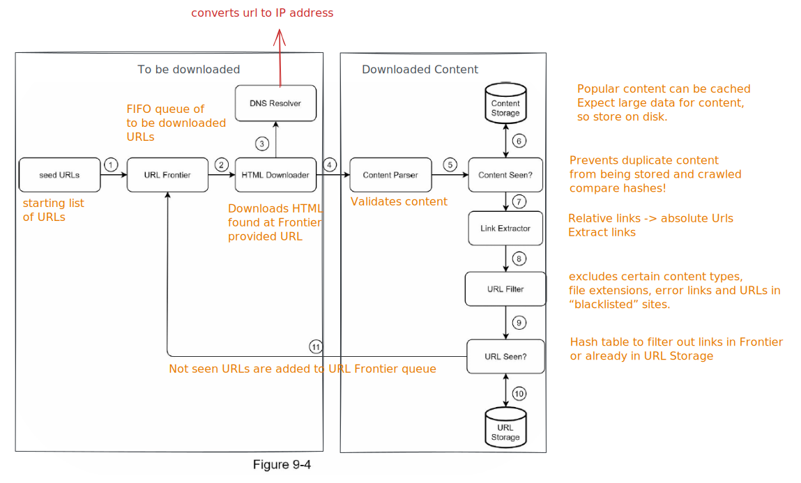

# Title: [Systems Design Interview Prep Book](Systems%20Design%20Interview%20Prep%20Book.md)

| Author  | Subject | Goodreads   | Reviewed Date  |
| ------- | ------- | ----------- | -------------- |
| Alex Xu | [Systems Design](Systems%20Design.md)        | ⭕  Not Yet | [2022-05-22](2022-05-22.md) |

## Chapters
### How to scale a system 
[Scaling from 1 user to 1M users](https://alexpareto.com/scalability/systems/2020/02/03/scaling-100k.html)📰

**Keep web tier [stateless](./HTTP.md#HTTP%20is%20stateless) (easier to horizontally scale)**
- *stateful servers remember client data* (e.g. session data) from one request to the next.
	- Requires that all client A traffic and client B traffic are routed to the same server that has their session data, every time.
	- can be done with sticky servers, but more challenging to horizontally scale
- *Stateless architecture* - HTTP requests can be sent to any web server, and web servers fetch state data from shared data store (SQL or NoSQL)

**Stateful vs Stateless Architecture**
 


**Build redundancy at every tier**
- horizontally scale web servers and use a [load balancer](./Load%20Balancing.md)
- use database replication (master for writes, multiple subs for reads) for better performance and reliability
**Cache data as much as you can**
- temporary data store that is much faster than web server
- can be scaled independently
- use when there are lots of reads, and less modifications
**Support multiple data centers**
- e.g. US-EAST1 , US-WEST1
- need traffic redirection tools (e.g. GeoDNS) to route traffic to the correct data center
- failover strategy - replicate data across multiple data centers (e.g. US-EAST1, US-EAST2...)
**Host static assets in [CDN](./Content%20Delivery%20Network.md)**

**Scale data tier via sharding**
- sharding separates large data bases into smaller parts that have the same schema, but unique portions of overall data
- data should be evenly distributed across shards;  hash functions used as way to look up data in corresponding shard
- need to manage resharding data if one gets exhausted or overloaded
- difficult to join data cross shards  
**Split tiers into individual services**
- use [message queues](./Message%20Queue.md)  to decouple services
**Monitor system & use automation tools**


###### Final Architecture: Scaled to handle 1M users

### Back of the Envelope estimations
thought experiment + common performance numbers

1. Estimate traffic (either DAUs or units per day)
2. Calculate unit / second
3. Declare a read to write ratio, and extrapolate into WPS or RPS
4. Make an estimation on storage needs (see [ URL shortener estimates](Systems%20Design%20Interview%20Prep%20Book.md#Design%20a%20url%20shorterner))

##### Power of 2

Commonly asked back-of-the-envelope estimations: QPS, peak QPS, storage, cache,
number of servers, etc.

### Framework for System Design Interviews
Scope/Requirements (3 - 10 minutes)
- What are the most important features? (2 - 3 sweet spot)
- How many users?
- Back of the envelope - Read: write, database storage needs
- How fast does the company anticipate to scale in 3 mos, 6 mo, 1 year?
- What's technology stack? (e.g. mobile/web, existing services)

Propose High level Design (diagram) (10 - 15 min)
- Get **buy in** on big components
	- Client, APIs, web servers, data stores, CDN, cache, message queue, etc
- Check if back of envelope is necessary

Deep dive or Optimizations for improvement (10 - 25 min)
- where are system bottle necks?
- 
Wrap up and summarize to remind interviewer all of the things you talked about!

### Design Rate Limiter
Scope:

🔑Design Decisions:
1. Where will the rate limiter live? --> [Rate Limiter > Ways to Implement](./Rate%20Limiter.md#Ways%20to%20Implement)
2. What is being rate limited? 
	1. Throttle by IP address, user id, by API end point...etc. will determine how many data structures you need to keep track of limits
3. What [algorithm](./Rate%20Limiter.md#Rate%20Limiting%20Algorithms) will be used?
4. Where will the store rate limiting data?
	1. request counter per user - Fast access is crucial so [Redis](./Redis.md) is great candidate
	2. rate limiting rules (generally config files) saved on disk
5. What to do with throttled requests?
	1. Notify client with 429 HTTP status code and extra info in response headers
	2. Drop or add to a [message queues](./Message%20Queue.md)
Challenges
	1. Race conditions when two rate limiters read/write at the same time may get incorrect counter value
		1. Solution: Redis sorted sets
	2. Synchronization issues if scaled rate-limiter service, they don't know about other rate limiters
		1. Solution: use a centralized data store like Redis (as opposed to sticky sessions)

Optimizations:
- Performance: reduce latency by using multi-region strategy or edge servers
- monitoring rate limiting algorithm is effective
- monitor rate limiting rules are effective or need to be tuned


### Design a chat system
###### Scoping
- Group vs 1:1 chat
- Mobile or web (client types)
- Scale: 50M DAU
- Important features: 1:1 chat, group chat, online indicator. Text based messages only
	- message size limit
	- if group, what are max limits on users in a group chat?
	- encryption (only if time allows)
	- persistence of chats?
	- push notifications

###### High level design
Chat Service functionality
- read messages from clients
- relay messages to recipient clients
 - indicate if a client is active or away (based on time online or last message sent?)
 - store metadata about a chat (e.g. which users are in it)
- store messages for each group in  persistent store

###### Communication protocol for Chat Service
- ❌Polling/Long-polling (connection kept alive longer until timeout threshold)
	- Inefficient due to # request/response cycles and possibility that user doesn't chat much
	- HTTP is stateless -- server receiving message probalby isn't the same server that has long-polling connection with client receiver
- ✅ [WebSockets](./WebSocket%20API.md)
	- use for both client sender and receiver to simplify
	- makes the Chat service *stateful*

❓Real-time service discussed in Designing a Notification System chapter.

###### Storing Chat Data
- massive amounts of chat data, ~60B / day @ facebook messenger
- recently chats are accessed frequently
- search/view mentions or jumping to time date might require random access of data
- 1:1 read to write ratio

Why KV Stores?
- Easy horizontal scaling
- low latency access to data
	- RMDBs don't handle long tail data well (indexes get too big and inefficient)
- FB (Hbase) and Discord ([Cassandra](./Cassandra.md)) use them

Data Models for messages
- `msg_id` is responsible for ordering of messages (since messages can be sent at the same time)
	- Since NoSQL dbs don't have auto increment, consider using a local sequence number generator
	- global is not needed, since you just need message order within a one-on-one channel or group channel
- use composite key for group messages


###### Deep dive areas
1. [Service Discovery](./Service%20Discovery.md) - how to discover chat servers for incoming client connections
	1. Use Apache Zookeeper to register all available chat servers, and pick best one for client based on criteria (server capacity, geographical location, etc.)
2. Message Flows
	1. Client -> Chat server -> Message sync queue -> write to KV Store
	2. If recipient is offline, push notification is sent from Notification Servers
	3. If recipient online, message is forwarded to recipients' chat server where recipient is connected

1. Group chat
	1. Outgoing messages from a user are copied to each recipient's message sync queue (like an inbox)


1. Message Synchronization for same user across devices
	1. Key challenge: how to tell when a message is considered "new"
	2. Each device tracks `cur_max_message_id` to track latest message ID on device, and can get new messages from KV store
2. Online Presence
	1. Presence servers manage online status by communicating with clients through WebSocket.
	2. After client is routed through Login service, a WS connection built and user's `last_active_at` timestamp saved in KV store by Presence server to show 🟢 online
	3.  User logs out through logout flow and status changed in KV store by Presence server 🔴
	4. Client sends❣️beat to determine online/offline every x interval rather than every connect/disconnect to WS, since this can happen often
	5. Update other users of status using pub/sub fanout
		1. Presence servers maintains a channel for each friend pair, and User A's status changes are published. Users in group chat are subscribed to User A's channel

### Design a url shorterner
###### Scope
- Volume of traffic: 100M URLs generated/ day
- Shortened URLs are as short as possible
- Allowable characters: digits and characters
- Assume no deletion or modification to shortened url
- System characteristics: high availability, scalability, and fault tolerant
- How long are shortened URLs stored for? Indefinitely
Use case:
- Big url --> shortened URL
- shortened URL --> redirects to original URL

###### Back of envelope estimates
```
100 million urls / day * 24 hrs * 3600 seconds = 1,160 wps
Assuming read to write ratio is 10:1 = 11,600 rps

Store URLs for 10 years
100 M * 365 days * 10 = 365,000,000,000 urls or 365 B

Assume average URL length is 100.
Storage required:
365 B * 100 bytes * 10 years 
= 365,000,000,000,000, or 365 TB
```
###### High Level Design
API needs to fulfill two functions:
- URL shortening - POST request with long url  
- URL redirecting - GET request with short url returns long url to redirect to


**Redirecting**
301 Redirect - resource permanently moved
- browser will cache this response and subsequent requests go straight to long URL server and skip tinyurl service
- better if you want to reduce tinyurl server load
302 Redirect - resource temporarily moved
- requests still go to tinyurl service first
- better for analytics to track clicks to short url
**Shortening** - hash the long URL
- hash function must hash long url to *one* hash value
- each hash value can be mapped back to long url

###### Deep Dive
**Data Model**
- Because of large amount of data to store and persistence, use a RMDB

**Hash value length**
- minimize hash value length
- must be able to generate 365 B unique urls
- allows 0-9, a-z, A-Z in hash value = 10 + 26 + 26 = 62 characters
- How many permutations of 62 chars can we generate that make *at least* 365 B unique combinations?
```
62^n >= 365B urls? 
... n = 7
Hash value must have at least 7 characters length
```


### Design a web crawler
###### What is it
- robot that discovers new or updated content on the web
- starts with one url, downloads all web pages, extracts URL from those pages, then add URLs to list of URLs to be downloaded.
- used for search engine indexing, web archiving, data mining
###### Key Characteristics
- a good web crawler can parallelize processes
- Robustness: should be able to handle bad or unresponsive pages
- Politeness: should not crawl the same site too frequently (too many requests)

Write path: URLS to be crawled
Read path: URLs  already crawled
###### Scope
- How many pages to crawl? One domain or all of the web?
- how often should a page be crawled
- what type of content is included - HTML
- Does this include edited pages or only newly added pages - both
- Do we need to store crawled pages and for how long - 5 years
- traffic: 1 billion pages crawled / month
###### Back of envelope
- Store URLs
	- Length of URL

```
1B / 30 days /24 hrs / 3600 = ~400 pg/second

Average size of HTML page crawled - 500KB
1B * 500KB = 500 TB storage per month

500 TB *12 * 5 = 30,000 TB or 30 PB for 5 years
```
###### High level design & Services

**Understanding web crawler workflow**


**Crawling algorithm**
- Web pages are a directed graph of links.
- Breadth first searc

**URL Frontier**
- FIFO queue of URLs to be downloaded
- can be ranked by priority factors (like popularity, authoritative sources)

**Content Seen**
- After web page is downloaded, parsed, and validated, check if content has already been seen before from a different URL
- compare two HTML documents character by character or by comparing hash values
- saves time and storage space from storing duplicate content
- may want a Content Storage

**URL extractor**
- prases and extracts links from HTML pages
- may want to filter for blacklisted sites 
- check if URL has been visited before or is already in queue to be downloaded
- Bloom filter and hash table are common to implement URL Seen component

**URL storage** stores visited URLs

###### Data Modelling & Data Structures
KV store for links to be crawled

###### Prioritizing URLs in Frontier
Goal: freshness, politeness, prioritization

Solutions from hitting same domain too many times:
- Create queues for different domains (stored in mapping table)
- Queue selection logic assigns workers to same queue and add in some delay logic
Solution for priority:
- Priority ranking service that prioritizes URLs and puts them in queues assigned with different weights of priority (e.g. Queue selector is biased twoards P1 queue )

Storage: Need to be able to hold billions of URLs but don't want to constantly read form disk
- Hybrid: store majority of URLS on disk, then keep some URLs for queue in buffer

---
Tags: [Systems Design](Systems%20Design.md)

Reference: [Capstone Notes](./Capstone%20Notes.md)

Related: 